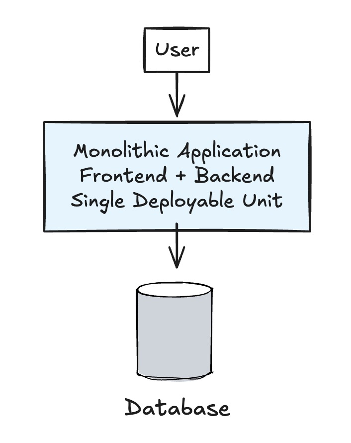

# Marketplace Item Review Feature

## Detail

### Business Domain or Category

Utility

### Project Description

A flexible review system that allows users to rate and review various marketplace items.

### Why

Users need authentic feedback to make informed decisions, while sellers and service providers benefit from customer insights and reputation building.

### Variant

- Product review
- Service review
- Rider review
- Logistics review
- Course review

## Overall architecture

[Insert your overall architecture here]

## Possible Architecture

### 1. Simple Local Architecture

